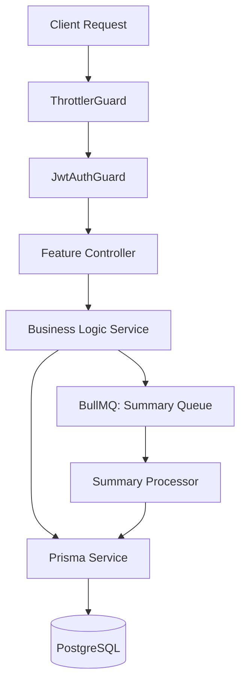
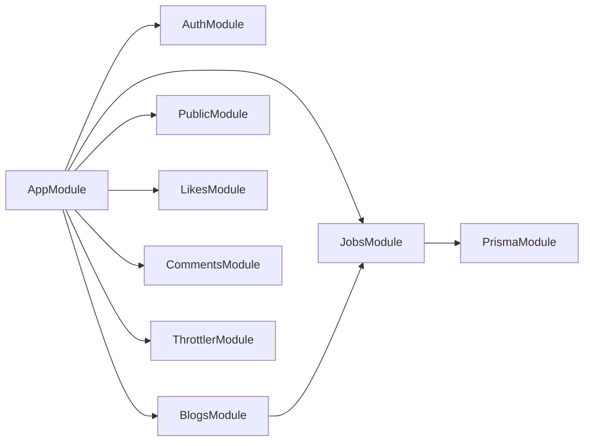

# Rival Backend - Production-Ready Blog API

A robust, secure, and scalable NestJS backend implementing a complete **Authentication System**, **Public & Private Blog Management**, and **Interaction Systems**.

## 🚀 Key Features

### 🔐 Authentication & Session Management
- **JWT Dual-Token Flow**: Implements short-lived Access Tokens and long-lived Refresh Tokens.
- **Server-Side Sessions**: Full session tracking (IP, User Agent) with the ability to revoke access remotely.
- **Secure Hashing**: Password protection using `bcrypt` with salt generation.
- **Identity Context**: Custom `@CurrentUser` and `@CurrentSession` decorators for clean ID extraction in controllers.
- **Rate Limiting**: Route-specific throttling for login (5req/15m) and registration (3req/h).

### 📝 Blog Management (Public & Private)
- **Ownership Enforcement**: Users can only manage their own blogs.
- **Deterministic Slugs**: Automatic slug generation from titles with safe collision handling.
- **Optimized Public Feed**: Paginated feed with interaction counts (Likes/Comments) and author info, utilizing indexed queries to avoid N+1 problems.
- **Public access**: Unauthenticated access to the global feed and specific blogs by slug.

### ❤️ Interaction Systems
- **Like System**: Idempotent toggle functionality for liking/unliking blogs.
- **Comment System**: Authenticated users can leave comments (1-1000 characters), with paginated retrieval.

### ⚡ Bonus Features
- **Async Summary Jobs**: Uses **BullMQ + Redis** to generate blog summaries in the background when a blog is published, ensuring non-blocking HTTP responses.
- **Advanced Rate Limiting**: Fine-grained throttling across public and private routes to prevent abuse.

## 🛠 Tech Stack

- **Framework**: [NestJS](https://nestjs.com/) (TypeScript)
- **Database**: [PostgreSQL](https://www.postgresql.org/)
- **ORM**: [Prisma](https://www.prisma.io/)
- **Queue**: [BullMQ](https://docs.bullmq.io/) with [Redis](https://redis.io/)
- **Security**: [Passport.js](https://www.passportjs.org/), [JWT](https://jwt.io/), [Bcrypt](https://github.com/kelektiv/node.bcrypt.js), [@nestjs/throttler](https://github.com/nestjs/throttler)
- **Validation**: [class-validator](https://github.com/typestack/class-validator), `ValidationPipe`

## 🏗 System Architecture



### Module Dependencies



## 🔐 Technical Implementation Details

### Optimized Performance
To avoid the N+1 query problem, the public feed uses Prisma's `include` and `_count` features in a single query transaction. This is paired with composite indexes on `isPublished` and `createdAt` for sub-millisecond lookups.

### Async Background Processing
Publishing a blog triggers an async job. The HTTP response is returned immediately, while a background worker (BullMQ) processes the content to generate a summary. This ensures high availability and low latency.

## 🚥 API Endpoints

### Auth
| Method | Endpoint | Limit | Description |
| :--- | :--- | :--- | :--- |
| POST | `/auth/register` | 3/h | Register a new user |
| POST | `/auth/login` | 5/15m | Login and receive JWT tokens |
| GET | `/auth/me` | - | Get current profile |

### Public (No Auth)
| Method | Endpoint | Limit | Description |
| :--- | :--- | :--- | :--- |
| GET | `/public/feed` | 30/min | Paginated list of published blogs |
| GET | `/public/blogs/:slug` | 60/min | Get blog by unique slug |

### Interactions (Auth)
| Method | Endpoint | Description |
| :--- | :--- | :--- |
| POST | `/blogs/:id/like` | Like a blog (Idempotent) |
| DELETE | `/blogs/:id/like` | Unlike a blog |
| GET | `/blogs/:id/likes` | Get like count & status |
| POST | `/blogs/:id/comments` | Add a comment (1-1000 chars) |
| GET | `/blogs/:id/comments` | Get paginated comments |

## 🛠 Project Setup

1. **Prerequisites**
   - PostgreSQL
   - Redis (Required for Jobs/Queues)

2. **Install Dependencies**
   ```bash
   npm install
   ```

3. **Database Initialization**
   ```bash
   npx prisma db push
   npx prisma generate
   ```

4. **Run Application**
   ```bash
   # Development
   npm run start:dev
   ```

---

