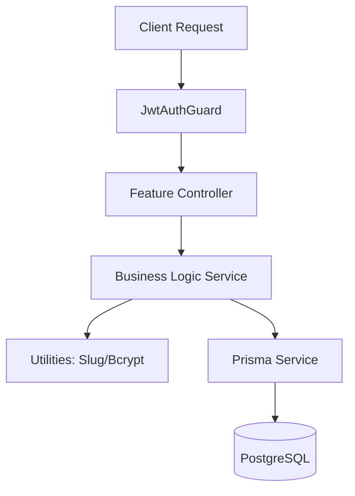
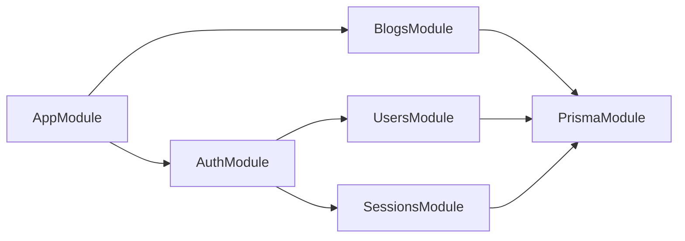

<p align="center">
  <a href="http://nestjs.com/" target="blank"></a>
</p>

# Rival Backend - Production-Ready Blog API

A robust, secure, and scalable NestJS backend implementing a complete **Authentication System** and **Private Blog Management** feature.

## 🚀 Key Features

### 🔐 Authentication & Session Management
- **JWT Dual-Token Flow**: Implements short-lived Access Tokens and long-lived Refresh Tokens.
- **Server-Side Sessions**: Full session tracking (IP, User Agent) with the ability to revoke access remotely.
- **Secure Hashing**: Password protection using `bcrypt` with salt generation.
- **Identity Context**: Custom `@CurrentUser` and `@CurrentSession` decorators for clean ID extraction in controllers.

### 📝 Private Blog CRUD (Phase 3)
- **Ownership Enforcement**: Users can only view, edit, or delete their own blogs via strict authorization guards.
- **Deterministic Slugs**: Automatic slug generation from titles with safe collision handling (`slug`, `slug-2`, etc.).
- **Advanced Querying**: Paginated listings with search, sorting, and filtering support.
- **Performance**: Composite database indexes for optimized dashboard queries.

## 🛠 Tech Stack

- **Framework**: [NestJS](https://nestjs.com/) (TypeScript)
- **Database**: [PostgreSQL](https://www.postgresql.org/)
- **ORM**: [Prisma](https://www.prisma.io/)
- **Security**: [Passport.js](https://www.passportjs.org/), [JWT](https://jwt.io/), [Bcrypt](https://github.com/kelektiv/node.bcrypt.js)
- **Validation**: [class-validator](https://github.com/typestack/class-validator), `ValidationPipe`

## 🏗 System Architecture

The following diagram illustrates the request flow and module dependencies within the system:



### Module Dependencies



## 🔐 Technical Implementation Details

### Slug Generation Logic
On blog creation or title update, the system uses a custom utility to:
1. Normalize the title (Lowercase, Strip unsafe chars).
2. Attempt to save the base slug.
3. Catch Prisma `P2002` (Unique Constraint) errors and execute a retry loop with incrementing suffixes until a unique slug is found.

### Ownership Security
Instead of generic ID checks, the `BlogsService` performs ownership verification before any sensitive operation.
- **403 Forbidden**: Returned if the resource exists but belongs to another user.
- **404 Not Found**: Returned if the resource ID does not exist.

## 🚥 API Endpoints

### Auth
| Method | Endpoint | Description |
| :--- | :--- | :--- |
| POST | `/auth/register` | Register a new user |
| POST | `/auth/login` | Login and receive JWT tokens |
| POST | `/auth/refresh` | Get a new access token using refresh token |
| GET | `/auth/me` | Get current user's profile |
| POST | `/auth/logout` | Invalidate current session |

### Blogs
| Method | Endpoint | Auth | Description |
| :--- | :--- | :--- | :--- |
| POST | `/blogs` | JWT | Create a new blog |
| GET | `/blogs` | JWT | List my blogs (Paginated) |
| GET | `/blogs/:id` | JWT | Get a specific blog (Owner only) |
| PATCH | `/blogs/:id` | JWT | Update blog (Owner only) |
| DELETE | `/blogs/:id` | JWT | Delete blog (Owner only) |

## 🛠 Project Setup

1. **Install Dependencies**
   ```bash
   npm install
   ```

2. **Environment Variables**
   Create a `.env` file in the root:
   ```env
   DATABASE_URL="your-postgresql-url"
   JWT_SECRET="your-access-token-secret"
   JWT_REFRESH_SECRET="your-refresh-token-secret"
   PORT=3001
   ```

3. **Database Initialization**
   ```bash
   npx prisma db push
   npx prisma generate
   npm run seed
   ```

4. **Run Application**
   ```bash
   # Development
   npm run start:dev
   ```

---
Developed by Antigravity AI
